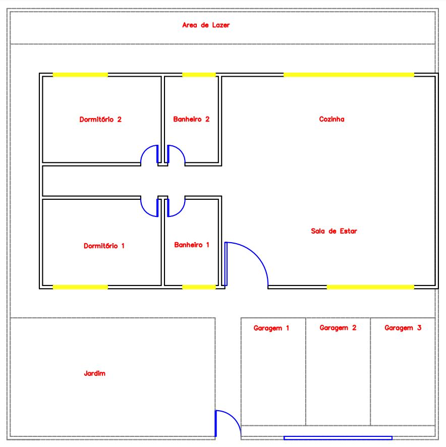
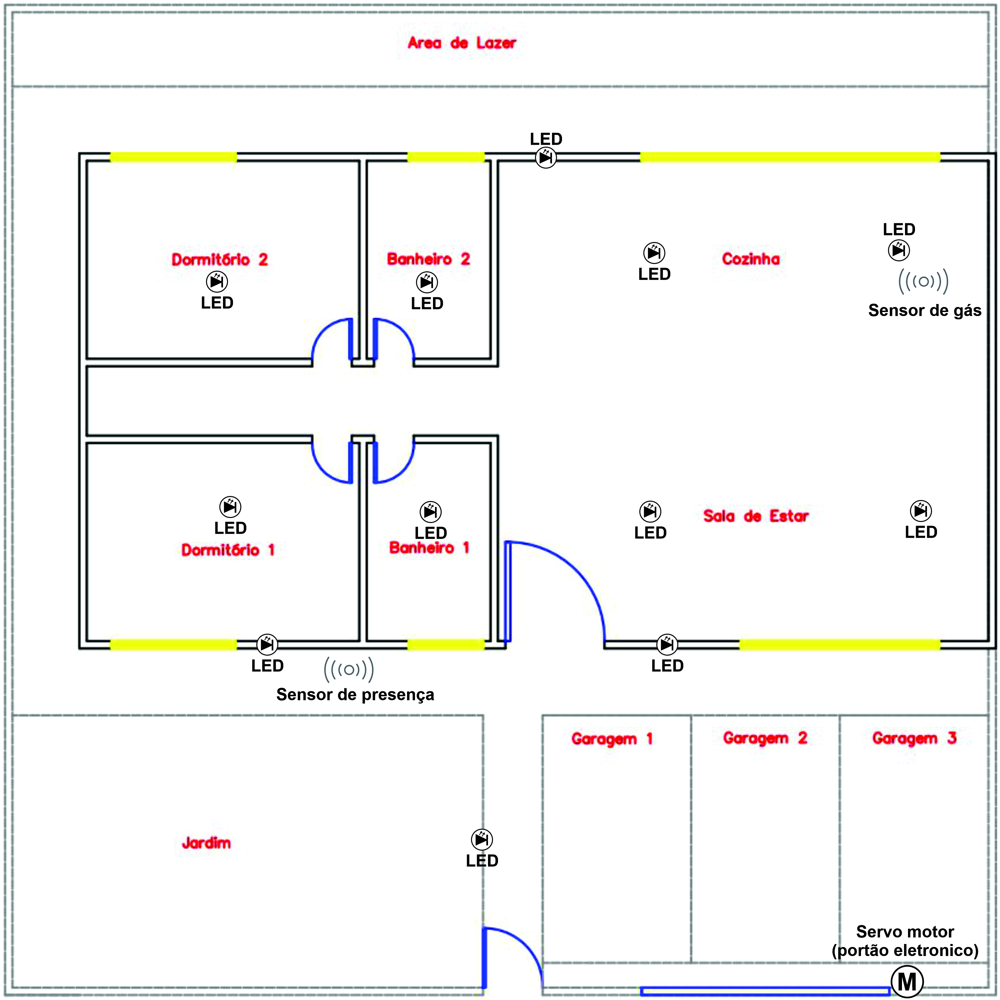

# Concepção

O projeto que iremos realizar tem como objetivo, demonstrar como a domótica pode ser aplicada em uma residência e os benefícios que a automação residencial pode trazer para o usuário final, aplicando e desenvolvendo as tecnologias escolhidas para chegar nesse objetivo. Pensando no projeto como um todo e não apenas como implementação de um hardware ou software, seguindo a metodologia CDIO.

O projeto será desenvolvido em uma maquete de uma residência, que será confeccionada posteriormente pelo estudante, devido a facilidade de implementação em menor escala. Serão utilizados sensores e atuadores diversos, atrelados a um microcontrolador, para realizar as ações de automação residencial.

Após o estudo sobre o tema do projeto, é necessário ter uma ideia da planta baixa da maquete residencial. Utilizando o software Auto CAD 2D, foi projetado uma planta baixa de uma casa simples com 2 quartos, 2 banheiros, 1 sala de estar, 1 cozinha, 3 vagas de garagem e um jardim.

O projeto possui alguns requisitos que devem ser compridos tal como:
- Controle de iluminação dos cômodos.
- Controlar os LEDs de iluminação de forma remota (com o computador).
- Utilizar um sensor de presença para o jardim e um sensor de gás.
- Implementar um servomotor para o portão eletrônico.

Os cômodos da maquete necessitam de um controle de iluminação remoto através do computador, portanto será aplicado um LED em cada dormitório e banheiro, e dois LEDs na sala e cozinha respectivamente, para termos uma iluminação eficiente devido ao tamanho destes ambientes. Na parte externa da casa também vão ser aplicados LEDs, dois na parte frontal e um nos fundos.

O sensor de gás será aplicado na cozinha, com o objetivo de detectar qualquer vazamento de gás que possa ocorrer, resultando em uma maior segurança. 

Temos também um sensor de presença aplicado na região frontal da casa, tendo a função de acionar os LEDs exteriores e comunicar pro computador que foi detectado movimento na parte externa da casa.

O servo motor será aplicado no portão eletrônico da residência, permitindo a entrada de pessoas e veículos, com acionamento remoto (com o computador).

Na imagem a seguir é apresentada a planta baixa, com a localização dos sensores e atuadores utilizados.

